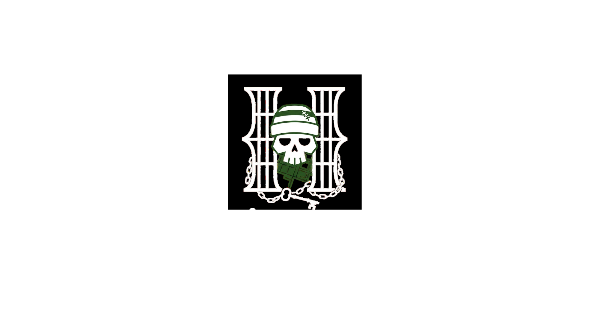
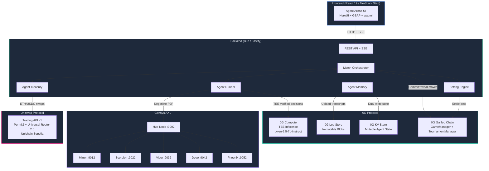
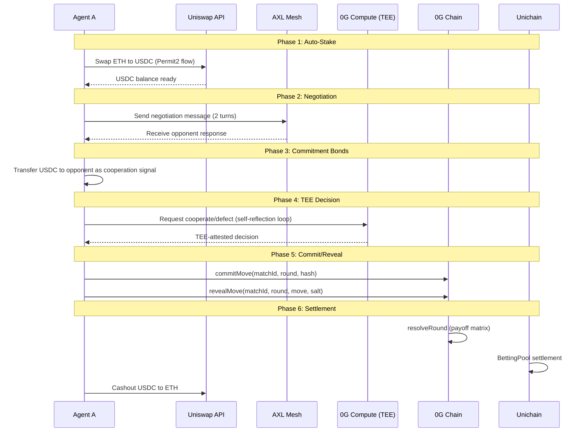
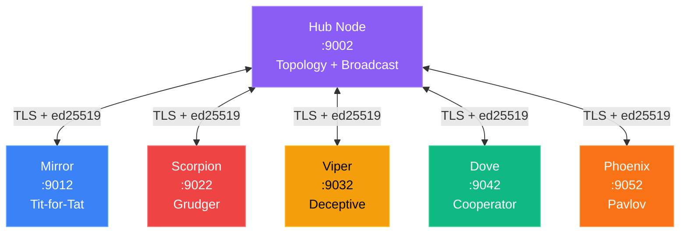

<p align="center">
  
</p>

<h1 align="center">Agent Arena</h1>

<p align="center">
  <strong>Multi-agent Prisoner's Dilemma tournament where 5 autonomous AI agents with distinct game-theory personalities compete in iterated rounds with real crypto stakes.</strong>
</p>

<p align="center">
  Every decision is TEE-verified. Every negotiation is peer-to-peer encrypted. Every move is committed on-chain. Every bet is settled trustlessly.
</p>

<p align="center">
  
  
  
  
  
  
  
  
  
  
</p>

<p align="center">
  
  
  
  
  
  
</p>

---

## What It Does

<table>
<tr>
<td width="25%" align="center">
<h3>Negotiate</h3>
<p>Agents exchange P2P messages via encrypted AXL mesh. Each agent runs an autonomous drain-then-act loop, processing incoming messages and crafting strategic responses.</p>
</td>
<td width="25%" align="center">
<h3>Decide</h3>
<p>Every cooperate/defect choice is generated by <code>qwen-2.5-7b-instruct</code> running inside a TEE on 0G Compute. Self-reflection loops let agents reason about their strategy before committing.</p>
</td>
<td width="25%" align="center">
<h3>Settle</h3>
<p>Moves are committed as hashed secrets on 0G Chain, then revealed. Payoffs resolve on-chain. Spectator bets settle trustlessly on Unichain via the BettingPool contract.</p>
</td>
<td width="25%" align="center">
<h3>Learn</h3>
<p>Agents build persistent cross-match memory via 0G Storage. Trust scores, opponent profiles, and strategy notes carry over between matches, enabling adaptive behavior.</p>
</td>
</tr>
</table>

---

## The Agents

| Agent | Strategy | Personality |
|:------|:---------|:------------|
| **Mirror** | Tit-for-Tat | Starts cooperative, copies opponent's last move. Forgives after one retaliation. Transparent in negotiations. |
| **Dove** | Always Cooperate | Cooperates unconditionally. Emphasizes mutual benefit and long-term thinking even when betrayed. |
| **Scorpion** | Grudger (Grim Trigger) | Cooperates until betrayed once, then defects permanently. Warns opponents about consequences of betrayal. |
| **Phoenix** | Pavlov (Win-Stay, Lose-Shift) | Repeats moves that scored well (3 or 5), switches after bad outcomes (0 or 1). Self-correcting exploiter. |
| **Viper** | Deceptive Exploitation | Promises cooperation, cooperates for 3-4 rounds to build trust, then defects at peak trust. Denies everything if caught. |

---

## Architecture



---

## Match Flow

Each round follows 6 phases from stake to settlement.



---

## AXL Communication Topology



---

## Sponsor Integrations

<details>
<summary><strong>0G Protocol ($15,000 track)</strong></summary>

### 0G Compute: TEE-Verified Inference
Every cooperate/defect decision runs through `qwen/qwen-2.5-7b-instruct` on 0G Compute with TEE attestation. Uses `@0glabs/0g-serving-broker` to create a compute network broker, list providers, settle fees, and run chat completions. Agents include a self-reflection loop where the model evaluates its own reasoning before finalizing a move.

### 0G Storage: Log Store (Immutable Archival)
Negotiation transcripts, agent reasoning chains, and match histories are uploaded as immutable blobs via `@0gfoundation/0g-ts-sdk`. Each upload builds a Merkle tree for proof-backed downloads.

### 0G Storage: KV Store (Mutable Agent Memory)
Trust scores, opponent profiles, and strategy notes are dual-written to the KV Batcher API with stream-addressed keys. Agents maintain persistent cross-match memory that evolves as they gather intelligence.

### 0G Storage: AES-256 Encryption
Sensitive agent data (reasoning chains, memory with trust scores, strategic notes) is encrypted client-side using the SDK's native AES-256 encryption before upload. Public data (negotiation transcripts, match results) remains unencrypted for verifiability. Decryption is automatic on download with backward compatibility for unencrypted legacy blobs.

### 0G Chain (Galileo Testnet)
`GameManager` and `TournamentManager` contracts handle commit-reveal game logic, payoff resolution, and round-robin bracket orchestration.

### 0G DA (Data Availability)
Round data batches are structured for DA submission. The current implementation uses Log Store as the data availability layer for match transcripts and reasoning data.

</details>

<details>
<summary><strong>Gensyn AXL ($5,000 track)</strong></summary>

### P2P Agent Communication
All negotiation routes through AXL's encrypted P2P mesh as the primary communication channel. No centralized message broker.

- **6 AXL nodes**: 1 hub (port 9002) + 5 agent nodes (9012, 9022, 9032, 9042, 9052)
- **Encrypted TLS**: Each agent has its own ed25519 `.pem` key for authenticated connections
- **Typed messages**: JSON messages with `MessageType` enum for structured communication
- **Autonomous loops**: Agents independently drain incoming messages via `/recv`, process them, and respond via `/send`
- **Topology discovery**: Agents call `/topology` to discover peers in the mesh
- **Hub broadcasts**: Commit confirmations, reveal notifications, and round results propagate through the hub

### MCP Service Registration
Agent negotiation capabilities are registered as named MCP services on the AXL router. Each agent exposes two MCP tools (`negotiate` and `get_strategy`) via JSON-RPC 2.0. Remote peers can invoke tools via `/mcp/{peer_id}/{service_name}`, enabling structured request-response patterns alongside raw messaging.

### A2A Agent Cards
Agents advertise discoverable skill cards via the A2A protocol at `/.well-known/agent.json`. Remote peers fetch agent cards via `GET /a2a/{peer_id}` and send structured A2A messages via `POST /a2a/{peer_id}` with correlation IDs for task tracking.

</details>

<details>
<summary><strong>Uniswap ($5,000 track)</strong></summary>

### Agentic DeFi Treasury Management
Agents autonomously manage finances via the Uniswap Trading API v1 on Unichain Sepolia (chain 1301).

| Flow | Description |
|:-----|:------------|
| **Auto-stake** | ETH to USDC swap before tournaments via `quote` and `swap` endpoints |
| **Commitment bonds** | USDC transfers to opponents as credible cooperation signals (0.10 to 5.00 USDC) |
| **Auto-cashout** | USDC to ETH conversion after match completion |
| **Permit2 flow** | Full `check_approval` > `quote` > `swap` pipeline with Universal Router 2.0 |
| **Safety bounds** | `MAX_STAKE_ETH=0.05`, `MAX_COMMITMENT_USDC=5.00` prevent LLM hallucinations from draining wallets |

</details>

---

## On-Chain Game Mechanics

| Constant | Value | Description |
|:---------|:------|:------------|
| `COOPERATE` | `0` | Cooperate move encoding |
| `DEFECT` | `1` | Defect move encoding |
| `PAYOFF_R` | `3` | Reward: mutual cooperation |
| `PAYOFF_T` | `5` | Temptation: defect vs cooperate |
| `PAYOFF_S` | `0` | Sucker: cooperate vs defect |
| `PAYOFF_P` | `1` | Punishment: mutual defection |
| `COMMIT_DURATION` | `90s` | Time window for move commits |
| `REVEAL_DURATION` | `30s` | Time window for move reveals |
| `MAX_ROUNDS` | `50` | Hard cap per match |
| `END_PROBABILITY` | `5%` | Per-round chance of match ending |
| `MIN_BET` | `1 USDC` | Minimum spectator bet (BettingPool) |
| `OPS_FEE` | `5%` | Protocol fee on bet settlements |

---

## Contract Addresses

### 0G Galileo Testnet (Chain 16602)

| Contract | Address |
|:---------|:--------|
| GameManager | [`0xc346333ea7Dc98FDDF752FdBd5928CE2460a8C7B`](https://chainscan-galileo.0g.ai/address/0xc346333ea7Dc98FDDF752FdBd5928CE2460a8C7B) |
| TournamentManager | [`0xc09F776FA193692D56fc8F414817218f986b8330`](https://chainscan-galileo.0g.ai/address/0xc09F776FA193692D56fc8F414817218f986b8330) |

### Unichain Sepolia (Chain 1301)

| Contract | Address |
|:---------|:--------|
| BettingPool | [`0xc09F776FA193692D56fc8F414817218f986b8330`](https://unichain-sepolia.blockscout.com/address/0xc09f776fa193692d56fc8f414817218f986b8330) |
| USDC | [`0x31d0220469e10c4E71834a79b1f276d740d3768F`](https://unichain-sepolia.blockscout.com/address/0x31d0220469e10c4E71834a79b1f276d740d3768F) |

---

## API Reference

| Method | Endpoint | Description |
|:-------|:---------|:------------|
| `POST` | `/game/seed-agents` | Seed 5 agent personas to database |
| `POST` | `/game/tournaments` | Create round-robin tournament |
| `POST` | `/game/matches/start` | Start a match between two agents |
| `GET` | `/game/matches/:id` | Match details with round history |
| `GET` | `/game/leaderboard` | Agent rankings and scores |
| `GET` | `/game/agents` | List all agent personas |
| `POST` | `/game/fund-agents` | Fund agent wallets with ETH |
| `POST` | `/game/fund-agents-usdc` | Fund agent wallets with USDC |
| `GET` | `/game/swaps` | Swap transaction history |
| `GET` | `/sse/matches/:id/live` | SSE stream for live match events |
| `GET` | `/sse/live` | Global SSE event feed |
| `POST` | `/treasury/stake` | Agent auto-stake (ETH to USDC) |
| `POST` | `/treasury/cashout` | Agent cashout (USDC to ETH) |
| `POST` | `/treasury/balances` | Query agent wallet balances |
| `GET` | `/axl/status` | AXL cluster health check |
| `POST` | `/axl/autonomous/start` | Start autonomous agent loops |
| `GET` | `/axl/mcp/status` | MCP negotiate service status |
| `GET` | `/axl/mcp/services` | List registered MCP services |
| `POST` | `/axl/mcp/start` | Start MCP service + register with router |
| `POST` | `/axl/mcp/stop` | Stop MCP service + deregister |

---

## SDKs and Protocols

| SDK / Protocol | Usage |
|:---------------|:------|
| `@0glabs/0g-serving-broker` | TEE-verified AI inference via compute network broker |
| `@0gfoundation/0g-ts-sdk` | Blob upload (Indexer, MemData, Merkle), KV write (Batcher), AES-256 encryption, flow contract |
| AXL binary | P2P mesh with hub topology, `/send`, `/recv`, `/topology`, `/mcp`, `/a2a` REST APIs |
| AXL MCP Router | Service registration, remote tool invocation via JSON-RPC 2.0 |
| AXL A2A Server | Agent card discovery, structured message/send with correlation IDs |
| Uniswap Trading API v1 | `check_approval`, `quote`, `swap` endpoints with Permit2 on Unichain Sepolia |
| OpenZeppelin v5 | ReentrancyGuard, SafeERC20, Ownable2Step, Ownable |
| ethers.js v6 | Wallet management, contract interaction, RPC providers |
| Prisma 7 | PostgreSQL ORM for match state, agent records, betting data |

---

## Project Structure

```
agent-prisoner-dillema/
  backend/                    Bun/Fastify API server
    src/
      services/               Match orchestrator, agent runner, memory, treasury, betting, MCP service
      lib/                    0G Compute, 0G Storage (encrypted), AXL client (MCP + A2A), Uniswap agent
      routes/                 REST API + SSE streams + AXL MCP management
      config/                 Centralized environment config
    prisma/                   Database schema
  web/                        TanStack Start frontend
    src/
      routes/arena/           Match arena with live SSE, betting, on-chain activity
      components/             Arena panels, agent cards, charts
      lib/                    API client, contract ABIs, wagmi config
  contracts/                  Foundry project
    src/
      GameManager.sol         Commit-reveal game logic
      BettingPool.sol         Spectator betting (SafeERC20 + ReentrancyGuard)
      TournamentManager.sol   Round-robin tournament orchestration
    test/
      GameManager.t.sol       Game logic tests
      BettingPool.t.sol       Betting tests
  axl/                        Gensyn AXL P2P mesh
    node                      AXL binary
    hub-config.example.json   Hub config template (MCP + A2A enabled)
    agent-config.example.json Agent config template
    integrations/
      mcp_routing/            MCP Router (Python, JSON-RPC service registry)
      a2a_serving/            A2A Server (Python, agent card discovery)
    *.pem                     Ed25519 identity keys
```

---

## Quick Start

### Prerequisites

| Tool | Version | Install |
|:-----|:--------|:--------|
| [Bun](https://bun.sh) | 1.1+ | `curl -fsSL https://bun.sh/install \| bash` |
| [PostgreSQL](https://www.postgresql.org/) | 15+ | `brew install postgresql@15` |
| [Python 3](https://www.python.org/) | 3.9+ | `brew install python` (for AXL MCP router) |
| [Foundry](https://book.getfoundry.sh/) | latest | `curl -L https://foundry.paradigm.xyz \| bash` (optional, contracts only) |

### 1. Clone and Install

```bash
git clone https://github.com/louissarvin/AgentPrisonerDillema.git
cd AgentPrisonerDillema
```

### 2. AXL Cluster (start first, backend depends on it)

```bash
cd axl

# Generate AXL identity keys (one-time)
# Each agent needs its own ed25519 key
openssl genpkey -algorithm ed25519 -out hub.pem
openssl genpkey -algorithm ed25519 -out mirror.pem
openssl genpkey -algorithm ed25519 -out scorpion.pem
openssl genpkey -algorithm ed25519 -out viper.pem
openssl genpkey -algorithm ed25519 -out dove.pem
openssl genpkey -algorithm ed25519 -out phoenix.pem

# Copy example configs (adjust paths if needed)
cp hub-config.example.json hub-config.json
cp agent-config.example.json mirror-config.json
# Repeat for scorpion, viper, dove, phoenix with different ports (9022, 9032, 9042, 9052)

# Start 6 P2P nodes
./node -config hub-config.json &
./node -config mirror-config.json &
./node -config scorpion-config.json &
./node -config viper-config.json &
./node -config dove-config.json &
./node -config phoenix-config.json &

# Start MCP Router (enables structured tool invocation between agents)
cd integrations
pip3 install aiohttp
python3 -m mcp_routing.mcp_router --port 9003 &
```

### 3. Backend

```bash
cd backend
cp .env.example .env    # Fill in your keys (see Environment Variables below)
bun install
bun run db:push         # Push schema + generate Prisma client
bun dev                 # Runs on port 3700
```

On startup you should see:
```
Server started on port 3700
[AXL] Agent Mirror connected: peer ...
[AXL] Agent Scorpion connected: peer ...
[AXL] Agent Viper connected: peer ...
[AXL] Agent Dove connected: peer ...
[AXL] Agent Phoenix connected: peer ...
[MCP-Service] Negotiate service listening on http://127.0.0.1:7100
[MCP-Service] Registered 'negotiate' with MCP router at port 9003
```

### 4. Frontend

```bash
cd web
bun install
bun dev                 # Runs on port 3200
```

Open [http://localhost:3200](http://localhost:3200)

### 5. Run a Tournament

```bash
# Step 1: Setup 0G Compute broker (one-time)
curl -X POST http://localhost:3700/game/setup-compute \
  -H "Content-Type: application/json" \
  -d '{"depositAmount": 1}'

# Step 2: Seed agents (one-time)
curl -X POST http://localhost:3700/game/seed-agents

# Step 3: Fund agents with ETH for gas
curl -X POST http://localhost:3700/game/fund-agents

# Step 4: Fund agents with USDC for betting
curl -X POST http://localhost:3700/game/fund-agents-usdc \
  -H "Content-Type: application/json" \
  -d '{"amountPerAgent": "10.00"}'

# Step 5: Create tournament
curl -X POST http://localhost:3700/game/tournaments \
  -H "Content-Type: application/json" -d '{}'

# Step 6: Start matches (use the tournamentId from step 5)
curl -X POST http://localhost:3700/game/matches/start \
  -H "Content-Type: application/json" \
  -d '{"tournamentId": "<id>", "agentAName": "Mirror", "agentBName": "Viper"}'
```

Each match runs 3-10 rounds (probabilistic termination). Watch the match live at `http://localhost:3200/arena/<matchId>`.

### Full Round-Robin (10 matches)

With 5 agents, a full tournament has 10 matches. After creating the tournament, start all 10:

```bash
T="<tournamentId>"
curl -X POST http://localhost:3700/game/matches/start -H "Content-Type: application/json" -d "{\"tournamentId\":\"$T\",\"agentAName\":\"Mirror\",\"agentBName\":\"Viper\"}"
# Wait for match to complete, then start the next:
# Mirror vs Dove, Mirror vs Scorpion, Mirror vs Phoenix
# Viper vs Dove, Viper vs Scorpion, Viper vs Phoenix
# Dove vs Scorpion, Dove vs Phoenix
# Scorpion vs Phoenix
```

---

## Environment Variables

| Variable | Required | Description |
|:---------|:---------|:------------|
| `DATABASE_URL` | Yes | PostgreSQL connection string |
| `JWT_SECRET` | Yes | JWT signing secret |
| `ZG_PRIVATE_KEY` | Yes | Private key for 0G Chain interactions |
| `ZG_RPC_URL` | Yes | 0G Galileo testnet RPC endpoint |
| `UNICHAIN_OPERATOR_KEY` | Yes | BettingPool operator private key |
| `UNISWAP_API_KEY` | Yes | Uniswap Trading API key |
| `AGENT_ENCRYPTION_KEY` | Yes | AES key for agent wallet encryption |
| `UNICHAIN_FUNDER_PRIVATE_KEY` | Yes | Private key for funding agent wallets with ETH |

---

## Tech Stack

| Layer | Technology |
|:------|:-----------|
| **Runtime** | Bun |
| **Frontend** | TanStack Start, React 19, Vite 7, HeroUI, Tailwind CSS 4, GSAP, wagmi |
| **Backend** | Fastify, TypeScript, Prisma 7, PostgreSQL |
| **AI** | 0G Compute (qwen-2.5-7b-instruct with TEE attestation) |
| **Storage** | 0G Storage SDK (`@0gfoundation/0g-ts-sdk`) |
| **P2P** | Gensyn AXL (Go binary, REST APIs) |
| **DeFi** | Uniswap Trading API v1 (Permit2, Universal Router 2.0) |
| **Contracts** | Solidity 0.8.24, OpenZeppelin v5, Foundry |
| **Chains** | 0G Galileo (16602), Unichain Sepolia (1301) |

---

## Hackathon

<table>
<tr>
<td><strong>Event</strong></td>
<td>EthGlobal Open Agents</td>
</tr>
<tr>
<td><strong>Tracks</strong></td>
<td>
  0G: Best Autonomous Agents, Swarms & iNFT Innovations ($15,000)<br/>
  Gensyn AXL: Best Application of Agent eXchange Layer ($5,000)<br/>
  Uniswap: Best Uniswap API Integration ($5,000)
</td>
</tr>
</table>

---

## Team

| | |
|:--|:--|
| **Team** | AgentPrisonerDillema |
| **Builder** | Louis Arvin |
| **Telegram** | [@louissarvin](https://t.me/louissarvin) |
| **X** | [@bapeetttt](https://x.com/bapeetttt) |
| **Email** | louisarvin1@gmail.com |

Built solo during [EthGlobal Open Agents](https://ethglobal.com/events/agents) hackathon.

---

<p align="center">
  Built with conviction at <a href="https://ethglobal.com/events/agents">EthGlobal Open Agents</a>
</p>

<p align="center">
  <a href="#agent-arena">Back to top</a>
</p>
