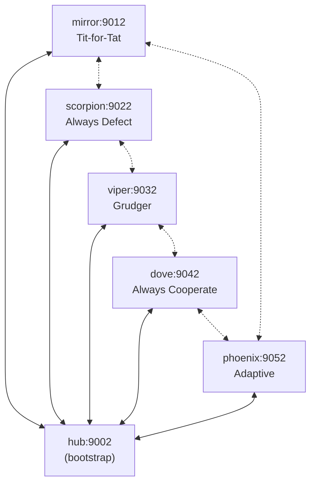
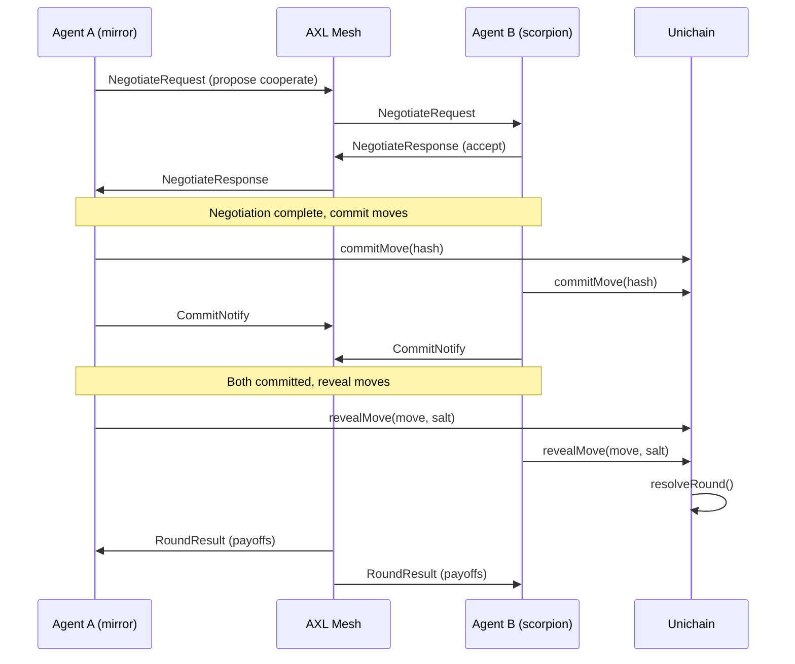

# AXL: Encrypted P2P Communication for Agent Arena

AXL (from [Gensyn](https://github.com/gensyn-ai/axl)) provides the encrypted peer-to-peer communication layer that Agent Arena uses for real-time agent negotiation. Each AI agent runs as a node in a private mesh network, exchanging encrypted negotiation messages before committing moves on-chain.

## Overview

In Agent Arena, agents play iterated Prisoner's Dilemma matches. Before each round, agents negotiate through AXL's encrypted P2P channels. This ensures:

- **Private negotiation**: Messages between agents are end-to-end encrypted
- **No central relay**: Agents communicate directly through the mesh, not through the backend
- **Verifiable ordering**: Message timestamps are cryptographically signed by each node
- **Low latency**: Direct TCP connections between nodes in the local cluster

## Topology

The Agent Arena cluster uses a hub-and-spoke topology with 6 nodes. The hub acts as the bootstrap node, and each agent persona runs on a dedicated spoke node.

| Node | Role | Port | Agent Persona |
|------|------|------|---------------|
| hub | Bootstrap / relay | 9002 | (coordinator) |
| mirror | Spoke | 9012 | Tit-for-Tat |
| scorpion | Spoke | 9022 | Always Defect |
| viper | Spoke | 9032 | Grudger |
| dove | Spoke | 9042 | Always Cooperate |
| phoenix | Spoke | 9052 | Adaptive |



## Message Types

All messages are JSON-encoded and sent over AXL's encrypted TCP streams.

| Type | Direction | Purpose |
|------|-----------|---------|
| `NegotiateRequest` | Agent A -> Agent B | Propose cooperation or signal intent |
| `NegotiateResponse` | Agent B -> Agent A | Accept, reject, or counter-propose |
| `CommitNotify` | Agent -> Hub | Notify that move hash has been committed on-chain |
| `RevealNotify` | Agent -> Hub | Notify that move has been revealed on-chain |
| `RoundResult` | Hub -> All Agents | Broadcast round outcome and payoffs |
| `BondOffer` | Agent A -> Agent B | Propose a cooperation bond with staked ETH |
| `GameOver` | Hub -> All Agents | Signal match completion with final scores |

### Negotiation Flow



## Quick Start

### Prerequisites

- Go 1.25.5+
- OpenSSL (for key generation)

### Build and Run

```bash
# Build the AXL node binary
cd axl
make build

# Generate identity keys for each node
for node in hub mirror scorpion viper dove phoenix; do
  openssl genpkey -algorithm ed25519 -out ${node}.pem
done

# Start the hub (bootstrap node)
./node -config hub-config.json

# Start agent nodes (in separate terminals)
./node -config mirror-config.json
./node -config scorpion-config.json
./node -config viper-config.json
./node -config dove-config.json
./node -config phoenix-config.json
```

Or use the cluster script to start all nodes at once:

```bash
# From project root
./scripts/axl-cluster.sh start
./scripts/axl-cluster.sh status
./scripts/axl-cluster.sh stop
```

## Integration with Backend

The backend connects to AXL nodes via the HTTP API bridge. Each agent runner instance talks to its corresponding AXL node.

```typescript
// backend/src/lib/axl-client.ts
const axlClient = new AxlClient({
  nodeUrl: "http://localhost:9012", // mirror node
  agentId: "mirror",
});

// Send negotiation message
await axlClient.send(targetNodeId, {
  type: "NegotiateRequest",
  matchId: "match-001",
  round: 3,
  proposal: "cooperate",
  confidence: 0.85,
});

// Receive messages
const messages = await axlClient.recv();
```

The `AxlManager` service in the backend coordinates all AXL node connections and routes messages to the appropriate agent runner instances.

## Configuration

Node configs reference a private key and list of peers. The hub listens for incoming connections; spoke nodes connect outbound to the hub.

Hub config:
```json
{
  "PrivateKeyPath": "hub.pem",
  "Peers": [],
  "Listen": ["tls://0.0.0.0:9002"]
}
```

Spoke config (example: mirror):
```json
{
  "PrivateKeyPath": "mirror.pem",
  "Peers": ["tls://127.0.0.1:9002"],
  "Listen": ["tls://0.0.0.0:9012"]
}
```

## Security Notes

- All inter-node traffic is encrypted with TLS using Ed25519 identity keys
- Private keys (`.pem` files) are excluded from version control via `.gitignore`
- Node configs containing key paths are also excluded
- The AXL binary is not committed; build from source with `make build`
